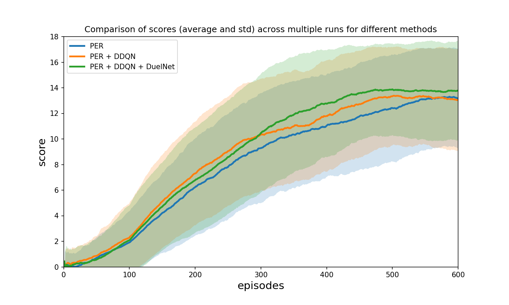
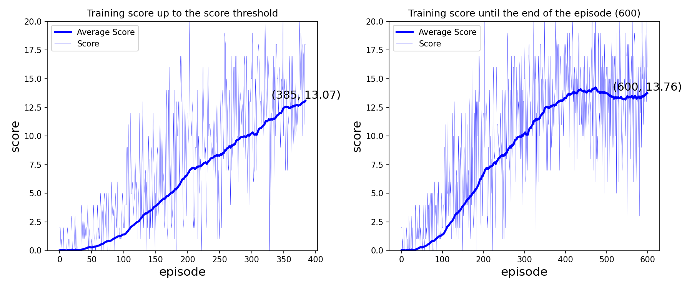
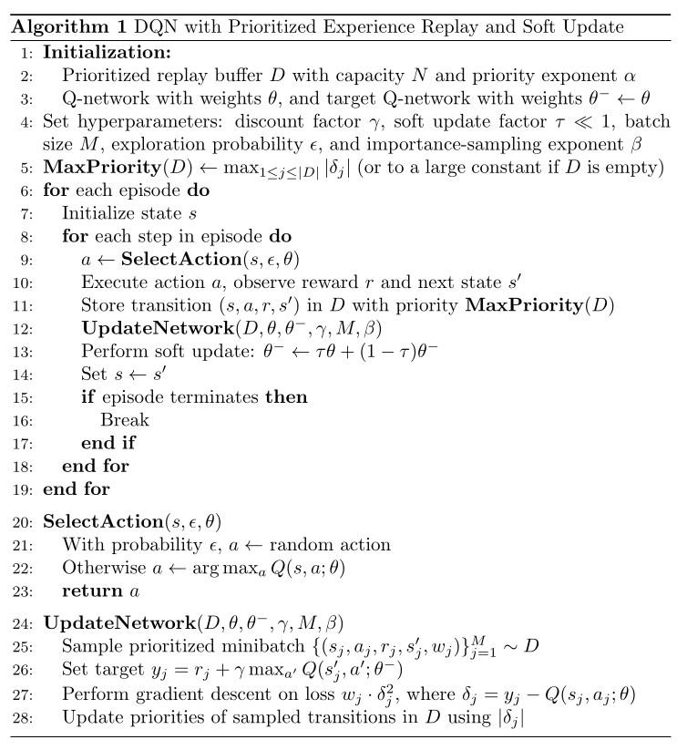

# Introduction
The following repo contains the implementation of several DQN algorithms and its variants/enhancements tried on the Unity Banana Collector Environment. 

<div style="text-align:center">


</div>

## Environment
The Unity Banana Collector (download versions for [Linux](https://s3-us-west-1.amazonaws.com/udacity-drlnd/P1/Banana/Banana_Linux.zip), [Mac](https://s3-us-west-1.amazonaws.com/udacity-drlnd/P1/Banana/Banana.app.zip) and [Windows](https://s3-us-west-1.amazonaws.com/udacity-drlnd/P1/Banana/Banana_Windows_x86_64.zip) here) is a navigation task. An agent must collect yellow bananas (+1 reward) while avoiding blue bananas (-1 reward). The objective is to collect as many of the former while avoiding the latter, maximizing the total reward. The episode ends after a fixed number of steps, specified by the user or trainer, typically in the hundreds, often around 300.

The state space is 37-dimensional, representing ray-based perception of nearby objects, the agent's velocity, etc..

The action space is a 4-dimensional discrete space that control the agent's movement in a coordinate system relative to its orientation (forward, backward, left and right).

## Goal
The goal is to train an agent that can reach an average reward of at least +13 over 100 episodes.


## Installation and dependencies
Unfortunately for the current version of the unity environments, including the banana collector environment, they can only be used with python 3.6.8, which is still accessible via conda and can be installed using the followings:

```bash
conda create -n myenv python=3.6.8 
conda activate myenv
pip install -r requirements.txt
```

## Running the code and training the agent

### Scope of this project
This project implements and runs experiments for the following three subvariants of DQN Algorithm: Case1  vanilla DQN plus the target network and prioritized experience replay buffer, referred to from hereon as PER. Case2 include the previous implementation plus the Double DQN. This can be done with a minimal change to the previous implementation. Case3 adds to Case 2 the Dueling Network.

### Code organization and running the training
All the code for the described three cases are in `dqn.py` file. To run the experiment, the user can simply import the routine `run_experiment1` from the file and provide a `Config` object with desired hyperparameters. For each case, we run 7 experiments and collect the scores in three separate json files (available at the root of the project).

### Choice of parameters 
The DQN algorithm contains a relatively large set of parameters, each can affect the speed of convergence to a large degree. Below, in Case 1, the base parameters for the case and subseuqnet cases have shown (Case 2 and 3). It should be noted the listed parameters are not exhaustive and there could be better choices for the hyperparameters that provide a faster convergence, but the reported cases have shown a relatively good performance for the available compute budget. 

#### Case 1: DQN Algorithm with Target Network and Prioritized Experience Replay Buffer (PER)
Much of the hyperparameters in this section are explained in the surveying section of the document. Set the config class as follows (copied from the `report.ipynb`):

```python 
config = Config(
    seed=101, batch_size=64, n_episodes=600, lr=1e-4,
    gamma=0.99, update_every=4, soft_update=1e-3,
    buffer_size=100_000, buffer_alpha=0.6, buffer_beta=0.4, buffer_eps=1e-5, buffer_beta_anneal_steps=100_000,
    dueling_network=False,
    double_dqn=False,
    t_max=500, score_threshold=13.0, score_window=100, eps_init=1.0, eps_final=0.01, eps_decay=0.975,
    device='cpu'
) 
``` 

#### Case 2 PER + Double DQN (DDQN)
Case 2 bring everything from the previous case and enables Double DQN as well. This can be done by setting `config.double_dqn = True`.

#### Case 3 PER + DDQN + Dueling Networks
Similar to Case2, we know enable the final flag to have an agent that trains using PER, DDQN and Dueling Networks by setting `config.dueling_network=True`. 


### Comparison of different algorithms

The graph below shows the comparison of convergence in three different cases mentioned above (PER, PER + DDQN and PER + DDQN + DuelingNet). For each case, the average of seven runs average score, over 100 episodes, is plotted in thick line, while the standard deviation of each case is plotted in the shades of the respective color. While all three cases appear to have the same standard deviation, it is apparent that Case3 is superior to other two in terms of the speed of convergence. 

<div style="width:90%; margin:auto;">


</div>


### Sample plots from an agent that solves the environment
The follwing plots demonstrate the convergence of the trained agent from Case3 to the specified goal of 13.0 over 100 episodes. The left plot is demonstrate the onset of convergance reached in 385 episodes and the right plot shows the score until the last episode, 600 episodes and average score of 13.76. 

<div style="width:80%; margin:auto;">


</div>


# A Survey of DQN Methods
## The base case with Prioritized Experience Replay Buffer, Target Network and Soft Update

This is manily based on the following two papers [Playing Atari with Deep Reinforcement Learning](https://arxiv.org/abs/1312.5602) and [Prioritized Experience Replay](https://arxiv.org/abs/1511.05952) and summarized in the algorithm below. The latter paper uses errors, computed from temporal differences, to assign different probabilities to different samepls, and then sample from the replay buffer using the computed probabilities. The details of the sampling can be found in the sections (3.3) and (3.4). The sampling and the buffer introduce two hyperparameters, $\alpha$ and $\beta$. According to the paper, $\alpha$ is kept constant at $0.6$ and $\beta = 0.4$ and gradually annealed to $1.0$ during the training. Samples with higher TD-errors are sampled more frequently during the training. 

<div style="width:75%; margin:auto;">


</div>

## Double Q-Learning
[Double DQN](https://arxiv.org/abs/1509.06461) decouple the lookup for optimal action and calculation of the Q function by using two different functions for the aforementioned tasks. Since the vanilla DQN with separate target, that was presented in the previous section, already has two identical Q function, the function that look up the optimal action can use the target Q function. 

## Dueling Networks
In the [Dueling DQN](https://arxiv.org/abs/1511.06581) paper, the Q-value function is decomposed into a state-value function $V(s)$ and an advantage function $A(s,a)$. Of the two variants proposed in the paper, the following is prefered for its stability, and Q-values are represented as:

$$
Q(s,a;\theta, \alpha, \beta) = V(s; \theta, \beta) + \left(A(s,a;\theta, \alpha) - \frac{1}{|\mathcal{A}|}\sum_{a'} A(s,a'; \theta,\alpha)\right),
$$ 

where $\mathcal{A}$ is the size of the action space and $\alpha$ and $\beta$ are parameters of two separate streams for value and action functions, respectively (not to be confused with $\alpha$ and $\beta$ from the prioritized experience replay buffer). The update procedure (experience replay and soft updates) is identical to standard or Double DQN; only the network structure and Q-value computation differ.

# Ideas for future work
Much more can be done to improve the agent's performance, including bringing more enhancements from the Rainbow paper, such as Noisy Networks, C-51 and multistep multistep Q-learning. 