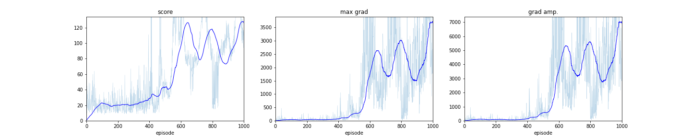

# REINFORCE

### Introduction
An implementation of REINFORCE algorithm is presented in this repository. It is based on the lesson from Udacity course on Deep Reinforcement Learning. The implementation, as opposed to the formulation (see the **Background** section), only uses a single tranjectory per gradient update. In this implementation, a trajectory coincides with an episode (check `collect_trajectories` method for details). 


### Getting Started
#### Installation
To install the package locally, `cd` to `reinforce` type the following form your terminal:
```bash
pip install -e .
```
after installation, one should be able to import the `reinforce` module and its functions:
```python
from reinforce.reinforce import wrapper
from reinforce.params import get_params
```
`wrapper` accepts a dictionary of parameters, accessed via `params.get_params` method, and runs REINFORCE with specified parameters. It is also possible to run the training via command, as described in the next section. 

### Instructions
#### Setting the parameters of the training
All the tweakable parameters of the training are accessible either from the config file `config.yaml` or via command line. A oneliner help for each parameter is displayed if `driver.py` is called using the following from the command line:

```
(venv) USER reinforce $ python driver.py -h
usage: driver.py [-h] [-c str] [--seed int] [--lr float] [--policy_fc_units int [int ...]] [--gamma float] [--n_episodes int] [--print_every int] [--max_t int]
                 [--env_name {CartPole-v1,LunarLander-v2,MountainCar-v0}] [--experiment_name str] [--generate_config] [--stop_at_threshold] [--score_threshold float]

Command line arguments from schema

optional arguments:
  -h, --help            show this help message and exit
  -c str, --config-file str
                        config file, including the path (default: None)
  --seed int            Seed number (default: None)
  --lr float            Optimizer learning rate (default: None)
  --policy_fc_units int [int ...]
                        list of space separated linear layers of the policy (default: None)
  --gamma float         Gamma parameter (discount factor). (default: None)
  --n_episodes int      Total number of episodes for training the environment. (default: None)
  --print_every int     Frequency of printing scores. (default: None)
  --max_t int           Maximum time steps for playing each episode. (default: None)
  --env_name {CartPole-v1,LunarLander-v2}
                        Name of the einvironment (default: None)
  --experiment_name str
                        Name of the experiment. (default: None)
  --generate_config     Generates the modified config file and quits. (default: None)
  --score_threshold float
                        Threshold value. Stop the training when the value is reached, if s`top_at_threshold` is True. (default: None)
```

Only two gym environments can be speicified as an input. This restriction is deliberate as REINFORCE is very noisy and hard to converge (in a sense of reaching a certain reward/goal threshold) without additional improvements to the algorithm.
### Background
We start by working the gradient of the expected return $U(\theta)$:

$$
U(\theta) = \sum_{\tau}P(\tau;\theta)R(\tau)
$$

where $P(\tau;\theta)$ is nonzero probability of trajectory $\tau$, parametrized by $\theta$. Moving the gradient inside the sum to get:

$$
\begin{align}
\nabla_{\theta} U(\theta) &= \sum_{\tau} \nabla_{\theta} P(\tau;\theta)R(\tau) \\
&=\sum_{\tau} \frac{P(\tau;\theta)}{P(\tau;\theta)} \nabla_{\theta} P(\tau;\theta)R(\tau) \\
&=\sum_{\tau} P(\tau;\theta) \nabla_{\theta} {\rm{log}}(P(\tau;\theta))R(\tau)
\end{align}
$$

The first part is straightforward and only involve algebraic manipulations. It is also called **the likelihood ratio trick**. We then approximate the gardient using the sample based approach:

$$
\begin{align}
\nabla_{\theta} U(\theta) \approx \frac{1}{m} \sum_{i=1}^m \nabla_{\theta} {\rm log} \mathbb{P}(\tau^{(i)};\theta)R(\tau^{(i)})
\end{align}
$$

I am not sure why the uniform distribution assumption is used here. We assume all the sampled trajectories have the same probability of occuring ($\frac{1}{m}$ on the right hand side of the above expression). Next we will focus on the first term in the sum, $\nabla_{\theta}{\rm log}\mathbb{P}(\tau^{(i)}; \theta)$. We use the state transition dynamics of the MDP to get:

$$
\begin{align}
\nabla_{\theta}{\rm log}\mathbb{P}(\tau^{(i)}; \theta) &= \nabla_{\theta} {\rm log} \left[
    \prod_{t=0}^H \mathbb{P}(s_{t+1}^{(i)}|s_t^{(i)},a_t^{(i)}) \pi_{\theta}(a_t^{(i)}|s_t^{(i)})
\right]\\
\end{align}
$$

Note that the state transitions are not parametrized by $\theta$ and so they won't make a contribution to our final result. Continuing the derivation, we get:

$$
\begin{align}
\nabla_{\theta}{\rm log}\mathbb{P}(\tau^{(i)}; \theta) &= \nabla_{\theta} {\rm log} \left[
    \sum_{t=0}^H \pi_{\theta}(a_t^{(i)}|s_t^{(i)})
\right]\\
&= \sum_{t=0}^H \nabla_{\theta} {\rm log} \pi_{\theta}(a_t^{(i)}|s_t^{(i)})
\end{align}
$$

Plug the last expression into the sample-based expression, we get the final result for estimate of the gradient in REINFORCE method:

$$
\nabla_{\theta} U(\theta) \approx \frac{1}{m} \sum_{i=1}^m \sum_{t=0}^H \nabla_{\theta} {\rm log} \pi_{\theta}(a_t^{(i)}|s_t^{(i)})R(\tau^{(i)}).
$$

### Results
The following shows the score of training for the `CartPole-v1` environment. All relevant files for this experiment are stored in the `results` folder. The jupyter notebook showcases how to use the installed modules in order to run an experiment in a notebook.

<div style="width:105%">


</div>

### Further improvements to the algorithm

### References
The REINFORCE algorithm was first proposed in the following works:
- Williams, R. J. (1988). Toward a theory of reinforcement-learning connectionist systems.
Technical Report NU-CCS-88-3, Northeastern University, College of Computer Science. \
- Williams, R. J. (1992). Simple statistical gradient-following algorithms for connectionist
reinforcement learning. Machine Learning 8:229-256. 
